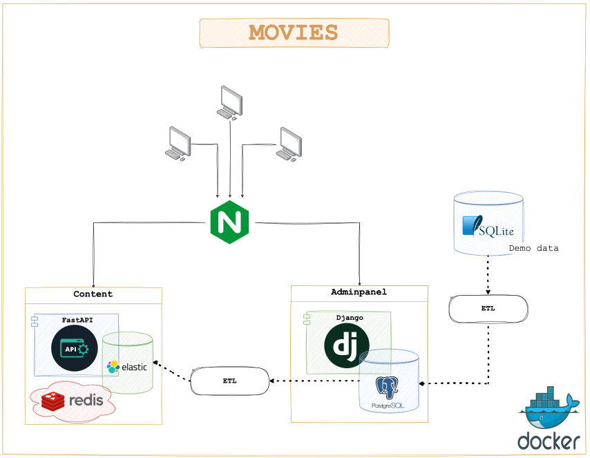

# Онлайн кинотеатр Movies


Movies - это backend для онлайн кинотеатра, предоставляющий API с возможностями полнотекстового поиска.

Проект включает в себя набор сервисов:
* `adminpanel` - админка для управления библиотекой кинотеатра на Django;
* `content` - API-сервис выдачи контента с возможностями полнотекстового поиска. `FastAPI` + `Elasticsearch` + `Redis`;
* `etl` - сервис для переноса данных из SQLite в PostgreSQL и из PostgreSQL в Elasticsearch.

Полностью в докере с удобными sh скриптами для инициализации, линтинга, форматинга, а также набор коротких и
часто используемых команд в Makefile.


## 📖 Содержание

- [✨ Особенности](#-Особенности-)
- [🛠️ Функционал сервиса](#%EF%B8%8F-функционал-сервиса-)
- [🏗️ Архитектура решения](#%EF%B8%8F-архитектура-решения-)
- [🚀 Быстрый старт](#-Быстрый-старт-)
    - [⚙️ Настройка переменных окружения](#%EF%B8%8F-настройка-переменных-окружения-)
    - [🏁 Запуск](#-Запуск-проекта-)
- [💻 Режим разработки](#-Режим-разработки-)
    - [📋 Pre requirements](#-pre-requirements-)
    - [🌐 Создание среды разработки](#-Создание-среды-разработки-)
    - [📚 Установить Poetry](#-Установить-Poetry-)
    - [🐳 Подробнее про Docker](#-Подробнее-про-Docker-)
    - [🔄 Окружения dev и prod](#-Окружения-dev-и-prod-)
    - [📜 Один Dockerfile для двух окружений](#-Один-Dockerfile-для-двух-окружений-)
- [🚀 Запуск проекта](#-Запуск-проекта-)
    - [👨‍💼 Запуск сервиса Adminpanel](#-Запуск-сервиса-Adminpanel-)
    - [📝 Запуск сервиса Content](#-Запуск-сервиса-Content-)
    - [🔄 Запуск ETL процессов](#-Запуск-ETL-процессов-)
    - [🔧 Полезные команды](#-Полезные-команды-)
- [📝 Особенности разработки](#-Особенности-разработки-)
    - [🔗 Управление зависимостями](#-Управление-зависимостями-)
    - [📝 Conventional Commits](#-conventional-commits-)
    - [🖥️ Настройки IDE](#%EF%B8%8F-настройки-ide-)
    - [🖊️ Форматер и линтер](#%EF%B8%8F-форматер-и-линтер-)


## ✨ Особенности [🔝](#-содержание)
* Поддерживает **Python 3.11+**;
* Полная **Docker** интеграция:
    * тонкие образы - **multi-stage сборка**;
    * **docker-compose** для локальной разработки;
    * тесты в **Docker**;
* **Django 4** + **PostgreSQL**:
    * API на **Django Rest Framework**;
    * Удобные настройки с [django-split-settings](https://github.com/wemake-services/django-split-settings);
    * Отдельная схема `content` в базе данных. Схема `public` только для стандартных `Django` таблиц;
    * Демобаза фильмов и сериалов;
* **FastAPI** + **Elasticsearch** + **Redis** - API для выдачи контента:
    * полностью асинхронный;
    * **OpenAPI** документация;
    * **Elasticsearch** для полнотекстового поиска;
    * **Redis** для кэширования;
* **CI** - workflow для GitHub Actions:
    * [Lint by black](https://github.com/xczdenis/movies/blob/main/.github/workflows/lint.yml#LL8C13-L8C13);
    * Lint by flake8;
    * Тесты в докере;
* **SOLID** код;
* **ETL процессы** для переноса данных между базами;
* **Celery** для управления расписанием запуска ETL процессов;
* **Pydantic** + **python-dotenv** для управления настройками;
* [src-шаблон](https://blog.ionelmc.ro/2014/05/25/python-packaging/) - отдельный пакет для каждого сервиса;
* Удобные **sh** скрипты:
    * [init.sh](https://github.com/xczdenis/movies/blob/main/src/scripts/init.sh) (`make init`) - инициализация проекта;
    * [lint.sh](https://github.com/xczdenis/movies/blob/main/src/scripts/lint.sh) (`make lint`) - линтинг (`black`, `flake8`, `isort`, `autoflake`);
    * [format.sh](https://github.com/xczdenis/movies/blob/main/src/scripts/format.sh) (`make format`) - форматирование;


## 🛠️ Функционал сервиса [🔝](#-содержание)

Сервис предоставляет следующий функционал:
1. База данных для фильмов, жанров, актеров (`PostgreSQL`);
2. Админка для управления контентом онлайн-кинотеатра (`Django`);
3. Заполненная база данных фильмов и сериалов (`SQLite`):
    * 5000+ персон (актеры, режиссеры, продюсеры);
    * 1000+ кинопроизведений;
    * 30+ жанров;
4. API-сервис для выдачи контента (`FastAPI` + `Elasticsearch` + `Redis`):
    * полностью асинхронный;
    * полное API для получения фильмов, жанров, персон;
    * полнотекстовый поиск по фильмам и персонам;
    * подробная документация API в формате `OpenAPI`;
5. ETL процессы для переноса данных:
    * from `SQLite` to `PostgreSQL`;
    * from `PostgreSQL` to `Elasticsearch`;
6. Запуск ETL процессов по расписанию с помощью `Celery`.

Подробную документацию API можно посмотреть по адресу: [http://localhost/api/v1/openapi](http://localhost/api/v1/openapi)


## 🏗️ Архитектура решения [🔝](#-содержание)




## 🚀 Быстрый старт [🔝](#-содержание)

Все команды, приведенные в данном руководстве, выполняются из корневой директории проекта, если иное не
указано в описании конкретной команды.


### ⚙️ Настройка переменных окружения [🔝](#-Быстрый-старт-)

Перед стартом, нужно создать файл `.env` в корне проекта. Это можно сделать, выполнив команду:
```bash
make env
```
Можно просто скопировать файл `env.template`.


### 🏁 Запуск [🔝](#-Быстрый-старт-)

🚨 Убедись, что у тебя свободны все порты, указанные в настройках, оканчивающихся на `_PORT` в файле `.env`.

🚨 Укажи свою платформу для docker образов в настройке `DOCKER_IMG_PLATFORM` в файле `.env`.
Например, для Mac на M1 вот так:
```bash
DOCKER_IMG_PLATFORM=linux/arm64
```

Запустить проект в докере:
```bash
make run
```
Приложение `adminpanel` будет доступно по адресу [http://localhost:8000](http://localhost:8000).

Приложение `content` будет доступно по адресу [http://localhost](http://localhost).

Документация API для приложения `content` доступна по адресу: [http://localhost/api/v1/openapi](http://localhost/api/v1/openapi).

Запустить тесты в докере:
```bash
make tests-docker
```
Запустить заполнение баз подготовленными демо-данными:
```bash
make demo
```
Остановить и удалить все запущенные контейнеры:
```bash
make down
```

## 💻 Режим разработки [🔝](#-содержание)


### 📚 Pre requirements [🔝](#-Режим-разработки-)
Для успешного развертывания среды разработки понадобится:

1. Python ^3.11;
2. Менеджер пакетов [Poetry](https://python-poetry.org/docs/#installation);
3. Docker (version ^23.0.5). Если у тебя его еще нет, следуй [инструкциям по установке](https://docs.docker.com/get-docker/);
4. Docker compose (version ^2.17.3). Обратись к официальной документации [для установки](https://docs.docker.com/compose/install/);
5. [Pre-commit](https://pre-commit.com/#install).

Также будет полезным:

1. [Hadolint](https://github.com/hadolint/hadolint) - линтер докер файлов.


### 🌐 Создание среды разработки [🔝](#-Режим-разработки-)

Перед выполнением команд из этого раздела, убедись, что у тебя установлены все компоненты [Pre requirements](#Pre-requirements-),
в противном случае, смотри инструкции по установке в подразделах ниже.

Для создания среды разработки, выполни следующие команды одну за другой, из корневой директории проекта:
```bash
make env
poetry shell
make init
```
Те же команды без `Makefile`:
```bash
cp .env.template .env
cp .env.local.template .env.local
poetry shell
poetry install
pre-commit install
pre-commit install --hook-type commit-msg
```


### 📖 Установить Poetry [🔝](#-Режим-разработки-)
Подробнее про установку Poetry [здесь](https://python-poetry.org/docs/#installation).

**Linux, macOS, Windows (WSL)**
```bash
curl -sSL https://install.python-poetry.org | python3 -
```

**Важно:** после установки, необходимо добавить путь к Poetry в свой `PATH`. Как правило, это делается
автоматически. Подробнее смотри в разделе [Add Poetry to your PATH](https://python-poetry.org/docs/#installation).

Проверить, что Poetry установлен корректно:
```bash
poetry --version

# Poetry (version 1.5.0)
```


### 🐳 Подробнее про Docker [🔝](#-Режим-разработки-)

Проект полностью интегрирован в `docker`. Для локальной разработки используется `docker-compose`.
Проект содержит следующие файлы docker-compose:

* **docker-compose.yml** - главный файл;
* **docker-compose.dev.yml** - содержит ***только изменения*** относительно главного файла, необходимые для режима разработки;
* **docker-compose.test.yml** - содержит ***только изменения*** для запуска тестов;


#### Файл docker-compose.yml [🔝](#-Подробнее-про-Docker-)
Файл `docker-compose.yml` - это главный compose-файл. Любая команда `docker-compose` должна использовать
этот файл в качестве первого аргумента.

Файл содержит все сервисы проекта (кроме тестовых) и основные метаданные для каждого сервиса,
такие как `build`, `env_file`, `depends_on` и т.п.

Файл `docker-compose.yml` **не должен** содержать портов, смотрящих наружу для сервисов баз данных.

#### Профили [🔝](#-Подробнее-про-Docker-)
Все сервисы в файле `docker-compose.yml` сгруппированы по профилям. Профили необходимы для возможности
запуска только определенной группы сервисов.

Главный профиль - `default`, все сервисы должны иметь этот профиль.

Существуют следующие профили:
* `default`
* `adminpanel`
* `content`
* `etl`

Например, к профилю `adminpanel` относятся только сервисы `postgres` и приложение `adminpanel` и больше ничего.
Запустить исключительно сервис `adminpanel` можно так:
```bash
make run-adminpanel
```


#### Файл docker-compose.dev.yml [🔝](#-Подробнее-про-Docker-)

Файл `docker-compose.dev.yml` используется для запуска проекта в режиме разработки. Здесь добавляются
изменения относительно `docker-compose.yml`. Например, здесь можно примонтировать тома для папок приложения
и указать порты, смотрящие наружу, чтобы облегчить отладку.


#### Файл docker-compose.test.yml [🔝](#-Подробнее-про-Docker-)

Файл `docker-compose.test.yml` содержит сервисы только для тестов. Этот файл используется для запуска
тестов в докере.


### 🔄 Окружения dev и prod [🔝](#-Режим-разработки-)

Основной тип запуска проекта - через docker-compose. Запуск проекта может быть выполнен в одном
из двух окружений: `development` или `production`. Окружение управляется настройкой `ENVIRONMENT` в
файле [.env](.env):
```bash
ENVIRONMENT=development
```

Если настройка `ENVIRONMENT` имеет значение `production`, то при запуске используется файл
[docker-compose.yml](docker-compose.yml). Если настройка `ENVIRONMENT` имеет значение `development`, то при
запуске используется дополнительный файл [docker-compose.dev.yml](docker-compose.dev.yml).

При запуске в режиме `development` папка приложения [src](src) монтируется как том, а каждый сервис
имеет `expose` порты:
```dockerfile
services:
    adminpanel:
        restart: "no"
        volumes:
            - ./src/${ADMINPANEL_PKG_NAME}:/${CONTAINER_WORK_DIR}/src/${ADMINPANEL_PKG_NAME}
    postgres:
        restart: "no"
        ports:
            - ${POSTGRES_PORT}:5432
```


### 📜 Один Dockerfile для двух окружений [🔝](#-Режим-разработки-)

Стоит обратить внимание на [Dockerfile](docker%2Fadminpanel%2FDockerfile) для сервисов `Adminpanel` и `Content`.
Помимо `multistage` сборки, данный файл использует слои `development` и `production` в соответствии с
настройкой `ENVIRONMENT`:
```dockerfile
# ./docker/adminpanel/Dockerfile
ARG env=production
...

FROM final as development


FROM final as production

COPY ./src/${pck_name} ./src/${pck_name}


FROM ${env}

ENTRYPOINT ["./scripts/entrypoint.sh"]
```

Данная конфигурация позволяет использовать разные итоговые образы в зависимости от режима запуска. При запуске
в режиме `development` папка приложения [src](src) монтируется как том в файле [docker-compose.dev.yml](docker-compose.dev.yml),
поэтому слой `development` в `Dockerfile` пустой:
```dockerfile
# ./docker/adminpanel/Dockerfile
...

FROM final as development

...
```
При запуске в окружении `production` папка приложения [src](src) копируется с помощью инструкции `COPY`:
```dockerfile
# ./docker/adminpanel/Dockerfile
...

FROM final as production

COPY ./src/${pck_name} ./src/${pck_name}
```
В конце файла, выбирается образ из переменной `env`:
```dockerfile
# ./docker/python/Dockerfile
ARG env=production
...

FROM ${env}
```

Переменная `env` в свою очередь передается как аргумент сборки:
```dockerfile
# ./docker-compose.yml
services:
    adminpanel:
        build:
            context: .
            dockerfile: ./docker/${ADMINPANEL_PKG_NAME}/Dockerfile
            args:
                env: ${ENVIRONMENT}
```
Итоговый образ будет использовать самый последний слой. Таким образом, если настройка `ENVIRONMENT` имеет
значение `development`, то будет использован образ `development`, а если `production`, то `production`.


## 🚀 Запуск проекта [🔝](#-содержание)

Файл [docker-compose.yml](docker-compose.yml) использует профили, что позволяет запускать отдельные наборы
сервисов. Основной профиль - это `default`, он указан для всех сервисов.

Запустить все сервисы проекта:
```bash
make run
```
Команда `make run` автоматически определяет режим запуска из настройки `ENVIRONMENT`.

Посмотреть все запущенные сервисы:
```bash
docker-compose ps
```
Нативная команда для запуска в окружении `development`:
```bash
docker-compose -f docker-compose.yml -f docker-compose.dev.yml --profile default up -d --build
```
Нативная команда для запуска в окружении `production`:
```bash
docker-compose --profile default up -d --build
```


### 👨‍💼 Запуск сервиса Adminpanel [🔝](#-Запуск-проекта-)

Запустить сервис **Adminpanel** в докере (`--profile adminpanel`):
```bash
make run-adminpanel
```
При запуске сервиса **Adminpanel** в докере, автоматически запускаются миграции базы данных и создается
суперюзер по настройкам из файла [.env](.env):
```bash
SUPERUSER_LOGIN=admin
SUPERUSER_EMAIL=admin@admin.com
SUPERUSER_PASSWORD=1
```
Для локального запуска сервиса **Adminpanel** нужно сначала запустить контейнер с базой данных:
```bash
make run s="postgres"
```
Создать миграции и выполнить их:
```bash
make migrate
```
Запустить только создание миграций:
```bash
make db-update
```
Нативная команда:
```bash
python src/adminpanel/manage.py makemigrations
```
Запустить только выполнение миграций:
```bash
make migrate
```
Нативная команда:
```bash
python src/adminpanel/manage.py migrate
```
Создать суперюзера:
```bash
make su
```
Нативная команда:
```bash
python src/adminpanel/manage.py create_superuser
```
Запустить сервис **Adminpanel** локально:
```bash
make adminpanel
```
Нативная команда:
```bash
python src/adminpanel/manage.py runserver
```


### 📝 Запуск сервиса Content [🔝](#-Запуск-проекта-)

Запустить только сервис **Content** (`--profile content`):
```bash
make run-content
```
Для локального запуска сервиса **Content** нужно сначала запустить контейнеры `elasticsearch` и `redis`.
Это можно сделать, запустив сервисы для профайла `etl`:
```bash
make run-etl
```
Запустить приложение `FastAPI` локально:
```bash
make content
```
Нативная команда:
```bash
python src/content/main.py
```


### 🔄 Запуск ETL процессов [🔝](#-Запуск-проекта-)
Запустить контейнеры, необходимые для ETL процессов (`--profile etl`):
```bash
make etl
```
Запустить ETL процесс для загрузки подготовленных демо-данных из `SQLite` в `PostgreSQL`:
```bash
make sql-to-pg
```
Нативная команда:
```bash
python src/etl/sqlite_to_pg.py
```
Запустить ETL процесс для переноса данных из `PostgreSQL` в `Elasticsearch`:
```bash
make pg-to-es
```
Нативная команда:
```bash
python src/etl/pg_to_es.py
```


### 🔧 Полезные команды [🔝](#-Запуск-проекта-)

Запустить несколько определенных сервисов:
```bash
make run s="postgres redis"
```
Зайти внутрь контейнера:
```bash
make bash
```
Далее ввести имя контейнера - тоже что и имя сервиса.

Посмотреть логи сервиса:
```bash
make logs
```
Далее ввести имя контейнера - тоже что и имя сервиса.

Остановить все сервисы и удалить контейнеры:
```bash
make down
```

Посмотреть текущий конфиг `docker-compose`:
```bash
make config
```

Удалить все неиспользуемые образы, контейнеры и тома:
```bash
make remove
```


## 📝 Особенности разработки [🔝](#-содержание)

При разработке необходимо придерживаться установленных правил оформления кода.
В этом разделе ты найдешь описание настроек редактора кода, линтеры и форматеры,
используемые в проекте, а также другие особенности, которые необходимо учитывать при разработке.


### 🔗 Управление зависимостями [🔝](#-Особенности-разработки-)

В качестве пакетного менеджера используется [Poetry](https://python-poetry.org/docs/#installation).
Для управления зависимостями используются группы (см. файл `pyproject.toml`).

🚨 Важно: каждая зависимость должна принадлежать **только одной** группе. Нельзя добавлять одну и ту же
зависимость в разные группы.

Если одна зависимость используется для различных сервисов, то она добавляется в дефолтную группу
`tool.poetry.dependencies`.

Все основные зависимости располагаются в дефолтной группе `tool.poetry.dependencies`:
```
[tool.poetry.dependencies]
python = "^3.11"
pydantic = "^1.10.2"
backoff = "^2.2.1"
```
Добавление основной зависимости:
```bash
poetry add pendulum
```
Остальные зависимости делятся на группы. Например, группа `adminpanel` - зависимостей для сервиса **Adminpanel**:
```
[tool.poetry.group.adminpanel.dependencies]
Django = "^4.1"
...
```
Добавление общей зависимости:
```bash
poetry add pytest
```
Добавление зависимости в конкретную группу (используй флаг `--group` и название группы):
```bash
poetry add pytest --group=test
```
Разделение зависимостей на группы позволяет уменьшить размер докер образов, так как в образы устанавливаются
только необходимые зависимости. Например, в образ сервиса **Adminpanel** будут установлены только зависимости
из группы `adminpanel` и дефолтной группы `tool.poetry.dependencies`:
```dockerfile
# ./docker/adminpanel/Dockerfile
...

RUN poetry config virtualenvs.in-project true \
    && poetry install --only main,adminpanel
```


### 📝 Conventional Commits [🔝](#-Особенности-разработки-)

Твои комментарии к коммитам должны соответствовать [Conventional Commits](https://www.conventionalcommits.org/).
Pre-commit хук `conventional-pre-commit` выполнит проверку комментария перед коммитом.

Если твой комментарий не соответствует конвенции, то в терминале ты увидишь подобное сообщение:
```bash
commitizen check.........................................................Failed
- hook id: commitizen
- exit code: 14
commit validation: failed!
please enter a commit message in the commitizen format.
```
Для более удобного написания комментариев к коммитам, ты можешь воспользоваться плагином
Conventional Commit для PyCharm:


### 🖥️ Настройки IDE [🔝](#-Особенности-разработки-)

Проект содержит файл `.editorconfig` - ознакомься с ним, чтобы узнать какие настройки
должны быть в твоем редакторе.

Основное:

* максимальная длина строки: 110;
* отступы: пробелы;
* количество отступов: 4.


### 🖊️ Форматер и линтер [🔝](#-Особенности-разработки-)

В качестве форматера мы используем [black](https://github.com/psf/black).
Конфиг black см. в файле `pyproject.toml` в секции `[tool.black]`.

Линтер - flake8, конфиг находится в файле `setup.cfg`.

Если ты используешь PyCharm, то можешь настроить форматирование файла с помощью black
через External Tools:


Также можно повесить на это действие hot key:


