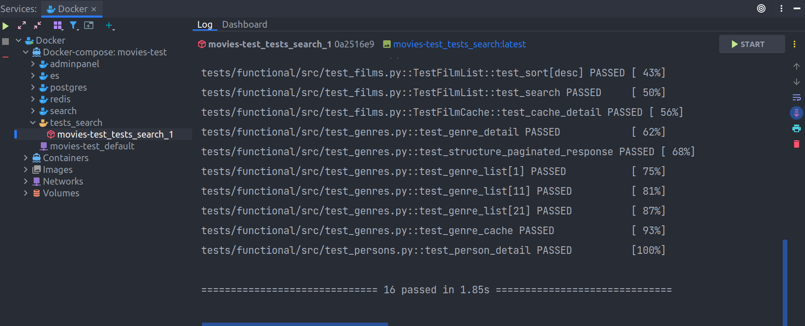
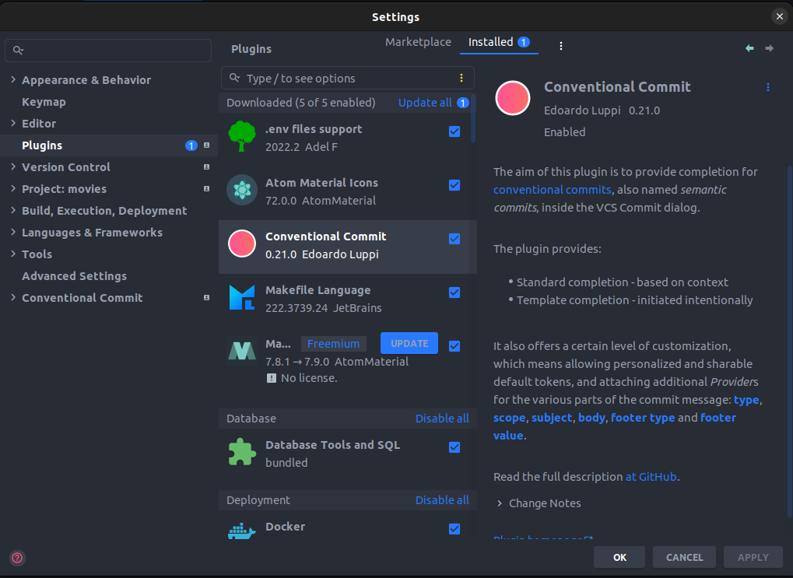

<h2 align="center">Movies</h2>


Онлайн кинотеатр (backend)


<h2 align="center">Содержание</h2>


1. [Запуск проекта](#запуск-проекта)
   1. [Настройка переменных окружения](#настройка-переменных-окружения)
   2. [Запуск проекта с помощью make](#запуск-проекта-с-помощью-make)
   3. [Наполнение базы тестовыми данными](#наполнение-базы-тестовыми-данными)
   4. [Запуск тестов](#запуск-тестов)
   5. [Подробнее про Docker](#подробнее-про-docker)
   6. [Запуск проекта без make](#запуск-проекта-без-make)
   7. [Запуск сервисов локально](#запуск-сервисов-локально)
2. [Режим разработки](#режим-разработки)
   1. [Prerequisites](#prerequisites)
   2. [Создание среды разработки](#создание-среды-разработки)
   3. [Установка pre-commit хуков](#установка-pre-commit-хуков)
3. [Особенности разработки](#особенности-разработки)
   1. [Управление зависимостями](#управление-зависимостями)
   2. [Структура каталогов](#структура-каталогов)
   3. [Импорты](#импорты)
   4. [Conventional Commits](#conventional-commits)
   5. [Настройки IDE](#настройки-ide)
   6. [Форматер и линтер](#форматер-и-линтер)
4. [Flow работы с проектом](#flow-работы-с-проектом)


<h2 align="center">Запуск проекта</h2>


Все команды, приведенные в данном руководстве, выполняются из корневой директории проекта.


### Настройка переменных окружения
Первое, что нужно сделать, после того как вы создали форк репозитория - настроить переменные окружения.
Для этого нужно создать файлы `.env`.
Для каждого файла `.env` имеется свой файл `.env.template`.

#### Локальные переменные окружения
Создайте файл `.env` в корне проекта - здесь хранятся локальные переменные окружения.
Это переменные хоста, они используются для запуска с помощью docker-compose.

#### Переменные окружения в папке .envs
Папка `.envs` содержит файлы `.env` со всеми переменными окружения, которые используются в проекте.
Здесь есть 2 каталога:
* development - переменные окружения для запуска в режиме разработки;
* production - переменные окружения для запуска в production режиме.

Создайте файлы `.env` в каждом каталоге.


### Запуск проекта с помощью make
Если вы работаете на Linux и у вас доступно выполнение команд с помощью `make`,
то вы можете использовать команды, приведенные в этом разделе. К сожалению,
на Windows эти команды работать не будут.

*Примечание:* для каждой команды существует 2 префикса: `dev` и `prod` (соответствуют режимам `development`
и `production`). Ниже будут приведены команды, с префиксом `dev` - их также можно запускать с префиксом `prod`.

*Обратите внимание:* docker-compose формирует название проекта из переменной окружения `COMPOSE_PROJECT_NAME`
(должна быть в файле `.env` в корне проекта). При запуске команды с префиксом `dev` к имени проекта
будет добавлено `-dev`. Например, если `COMPOSE_PROJECT_NAME == movies`, то сервис docker-compose
будет называться `movies-dev`. Для тестов сервис будет называться `movies-test`.


#### Запустить все сервисы
```bash
make dev

# make prod - run in production mode
```

#### Запустить конкретный сервис
Укажите ключ `s` с названием сервиса, чтобы запустить только 1 сервис:
```bash
make dev s=postgres
```

#### Посмотреть логи сервиса
Укажите ключ `s` с названием сервиса, чтобы посмотреть его логи:
```bash
make dev-logs s=postgres
```

#### Проверить конфигурацию docker-compose
```bash
make dev-check
```

#### Остановить все сервисы
```bash
make dev-stop
```

#### Остановить конкретный сервис
```bash
make dev-stop s=postgres
```

#### Остановить все сервисы и удалить контейнеры
```bash
make dev-down
```

#### Остановить все сервисы и удалить контейнеры для всех окружений
```bash
make down
```


### Наполнение базы тестовыми данными
После того как вы запустили проект, у вас будет пустая база данных.
Вы можете наполнить её тестовыми данными. Для этого разработаны 2 ETL процесса:
1. Перенос данных из SQLite в Postgres;
2. Перенос данных из Postgres в Elasticsearch.

#### Перенос данных из SQLite в Postgres
Сервис, реализующий перенос данных между базами, находится в каталоге `etl`.
Для того чтобы перенести данные из sqlite в postgres, поместите файл базы sqlite в каталог `etl/src/files`
(создайте каталог `files`, если у вас его нет).

**Важно**: файл базы данных должен называться `db.sqlite`. Переименуйте файл, если он у вас называется по-другому.

Запустить перенос данных:
```bash
make sqlite-to-pg
```
*Обратите внимание:* сервис `sqlite_to_pg` по умолчанию запускается в режиме development,
переменные окружения берутся из каталога `.envs/development`. Если вы хотите запустить перенос
в режиме production, то перед запуском файла установите переменной окружения `ENVIRONMENT` значение `production`.

#### Перенос данных из Postgres в Elasticsearch
Сервис `pg-to-es` переносит из Postgres в Elasticsearch данные, которые были изменены с даты последнего изменения
(анализируется реквизит `updated_at` каждой таблицы).
Дата последнего изменения хранится в хранилище - файл `state.json` в папке `etl`.
Если этого файла нет, то будут перенесены все данные, после чего файл `state.json` будет создан автоматически.

Запустить перенос данных:
```bash
make pg-to-es
```
Если вы захотите заново перенести все данные, то удалите файл `state.json` и запустите перенос.


### Запуск тестов
Тесты можно запускать в двух режимах: интерактивно и в режиме демона.
Запускать тесты в режиме демона удобно для отладки: вы можете подключить сервис Docker в PyCharm,
запустить тесты, изменить код теста и перезапустить контейнер с тестами,
с помощью PyCharm (кнопка Start справа вверху) - это не затронет ваш терминал и не нужно будет выполнять лишние команды:


Запустить тесты в режиме демона:
```bash
make test
```
Посмотреть логи тестов для сервиса `search`:
```bash
make test-logs s=tests_search
```
Запустить тесты интерактивно (логи будут в терминале):
```bash
make test-it
```
Остановить запущенные контейнеры тестов:
```bash
make test-stop
```
Остановить и удалить запущенные контейнеры тестов:
```bash
make test-down
```
Проверить конфигурацию тестов:
```bash
make test-check
```


### Подробнее про Docker
Запуск проекта выполняется с помощью docker-compose. Проект содержит следующие файлы docker-compose:
* **docker-compose.yml** - главный файл;
* **docker-compose.dev.yml** - содержит **только изменения** относительно главного файла, необходимые для режима разработки;
* **docker-compose.test.yml** - содержит **только изменения** для запуска тестов;
* **docker-compose.test.dev.yml** - содержит **только изменения** относительно `docker-compose.test.yml`;
* **docker-compose.prod.yml** - содержит **только изменения** для режима `production`;

#### Описание docker-compose.yml
Файл `docker-compose.yml` - это главный compose-файл. Любая команда `docker-compose` должна использовать этот файл в качестве первого аргумента.
Файл содержит все сервисы проекта (кроме тестовых) и основные метаданные для каждого сервиса,
такие как `build`, `env_file`, `depends_on` и т.п.

Файл `docker-compose.yml` **не должен** содержать разделов с монтированием томов (`volume`)
и указанием портов (`ports`), особенно здесь не должно быть портов, смотрящих наружу.

#### Описание docker-compose.dev.yml
Файл `docker-compose.dev.yml` используется для запуска проекта в режиме разработки.
Здесь добавляются изменения относительно `docker-compose.yml`.
Например, здесь можно примонтировать тома для папок приложения и указать порты, смотрящие наружу,
чтобы облегчить отладку.

#### Описание docker-compose.test.yml
Файл `docker-compose.test.yml` содержит сервисы только для тестов. Этого файла достаточно,
чтобы запустить тесты.

Этот файл **не должен** содержать разделов с монтированием томов (`volume`)
и указанием портов (`ports`) из соображений безопасности.
С помощью этого файла запускаются тесты в CI (git hub actions). Несмотря на то,
что тесты запускаются в изолированном контейнере, монтировать папки приложений
при запуске в любой среде, отличной от локального компьютера - это не хорошо.

Вы можете запустить тесты следующей командой:
```bash
docker-compose -f docker-compose.yml -f docker-compose.test.yml up -d --build
```
При этом не будет выполнено монтирование папок приложений в контейнеры.
Возможно, вы захотите это сделать, чтобы ускорить отладку тестов.
Для этого используется файл `docker-compose.test.dev.yml`.

#### Описание docker-compose.test.dev.yml
Файл `docker-compose.test.dev.yml` используется для запуска тестов в режиме разработки.
Здесь добавляются изменения относительно `docker-compose.test.yml`.
Например, здесь можно примонтировать тома для папок приложения и указать порты, смотрящие наружу,
чтобы облегчить написание и отладку тестов.


### Запуск проекта без make
Запуск в режиме production:
```bash
docker-compose -f docker-compose.yml -f docker-compose.prod.yml up -d --build
```
Запуск в режиме development:
```bash
docker-compose -f docker-compose.yml -f docker-compose.dev.yml up -d --build
```
Запуск тестов в режиме production (без монтирования папок приложений):
```bash
docker-compose -f docker-compose.yml -f docker-compose.test.yml up -d --build
```
Запуск тестов в режиме development (с монтирования папок приложений и открытие портов):
```bash
docker-compose -f docker-compose.yml -f docker-compose.test.yml -f docker-compose.test.dev.yml up -d --build
```
Для запуска тестов интерактивно, нужно сначала сбилдить образы, а затем запустить контейнер с тестами.

Сбилдить образы:
```bash
docker-compose -f docker-compose.yml -f docker-compose.test.yml build
```
Запустить тесты для сервиса `search`:
```bash
docker-compose -f docker-compose.yml -f docker-compose.test.yml run tests_search
```


### Запуск сервисов локально
Вы можете запустить каждый сервис локально, не используя docker.

#### Запуск сервиса adminpanel
**Важно:** для запуска сервиса `adminpanel` локально у вас должна быть запущена база данных.

Вы можете запустить базу данных отдельно. Используя Make:
```bash
make dev s=postgres
```
Вручную:
```bash
docker-compose -f docker-compose.yml -f docker-compose.dev.yml up -d --build postgres
```

Для запуска сервиса `adminpanel` локально перейдите в каталог `adminpanel/src`:
```bash
cd adminpanel/src
```
Примените миграции и выполните запуск сервиса:
```bash
python manage.py migrate
python manage.py runserver
```
Можно запустить сервис из корневой директории:
```bash
python adminpanel/src/manage.py runserver
```

#### Запуск сервиса search
Перед запуском сервиса `search`, убедитесь что у вас запущены redis и elasticsearch.

Запустить сервис `search`:
```bash
python search/src/main.py
```

#### Перенос данных из SQLite в Postgres
Для запуска переноса данных запустите файл `sqlite_to_pg.py`:
```bash
python etl/src/sqlite_to_pg.py
```

#### Перенос данных из Postgres в Elasticsearch
Для запуска переноса данных запустите файл `pg_to_es.py`:
```bash
python etl/src/pg_to_es.py
```


<h2 align="center">Режим разработки</h2>


**Важно:** перед началом разработки, выполните все пункты данного раздела!


### Prerequisites
Для успешного развертывания среды разработки вам понадобится:
1. Docker (version ^20.10.17). Если у вас его еще нет, следуйте [инструкциям по установке](https://docs.docker.com/get-docker/);
2. Docker-compose (version ^1.29.2). Обратитесь к официальной документации [для установки](https://docs.docker.com/compose/install/);
3. [Pre-commit](https://pre-commit.com/#install).

Также будет полезным:
1. [Hadolint](https://github.com/hadolint/hadolint) - линтер докер файлов.


### Создание среды разработки
#### 1. Установить пакет libpq-dev
**Важно:** этот пакет нужен для корректной работы `psycopg2`. Без этого пакета `psycopg2` не установится.
```bash
sudo apt update
sudo apt install libpq-dev
```

#### 2. Установить Poetry
Подробнее про установку Poetry [здесь](https://python-poetry.org/docs/#installation).

**Linux, macOS, Windows (WSL)**
```bash
curl -sSL https://install.python-poetry.org | python3 - --version 1.2.0rc2
```
**Важно:** перезапустите ОС после установки Poetry. Также, после установки, необходимо добавить путь к Poetry в свой PATH. Как правило, это делается автоматически.
Подробнее смотри в разделе [Add Poetry to your PATH](https://python-poetry.org/docs/#installation).

**Windows (Powershell)**
```bash
> (Invoke-WebRequest -Uri https://install.python-poetry.org -UseBasicParsing).Content | py - --version 1.2.0rc2
or
> pip install poetry==1.2.0rc2
```
**Важно:** необходимо добавить путь к Poetry в переменную `PATH`. Затем перезапустить IDE. Узнать путь к `poetry` можно так:
```bash
where poetry
```

#### 3. Проверить, что Poetry установлен корректно
```bash
poetry --version

# Poetry (version 1.2.0rc2)
```

#### 4. Создать и активировать виртуальную среду
```bash
poetry shell
```

#### 5. Установить зависимости
```bash
poetry install
```

#### 6. Установить hadolint (опционально)
```bash
sudo wget -O /bin/hadolint https://github.com/hadolint/hadolint/releases/download/v2.10.0/hadolint-Linux-x86_64
sudo chmod +x /bin/hadolint
```


### Установка pre-commit хуков
#### 1. Проверка установки pre-commit
Пакет [pre-commit](https://pre-commit.com/) включен в список зависимостей и устанавливается командой `poetry install`. Для проверки корректности установки `pre-commit` нужно выполнить команду:
```bash
pre-commit --version
```
В ответ вы должны получить версию pre-commit - это значит, что все установлено корректно:
```bash
pre-commit 2.20.0
```

#### 2. Установка скриптов git hook
```bash
pre-commit install
pre-commit install --hook-type commit-msg
```
Если установка прошла успешно, то увидите следующее сообщение:
```bash
pre-commit installed at .git/hooks/pre-commit
```


<h2 align="center">Особенности разработки</h2>


При разработке необходимо придерживаться установленных правил оформления кода.
В этом разделе вы найдете описание настроек редактора кода, линтеры и форматеры, используемые в проекте,
а также другие особенности, которые необходимо учитывать при разработке.


### Управление зависимостями
В качестве пакетного менеджера используется [Poetry version 1.2.0rc2](https://python-poetry.org/docs/1.2/#installation). Для управления зависимостями используются группы (см. файл `pyproject.toml`).

Все основные зависимости располагаются в группе `tool.poetry.dependencies`:
```
[tool.poetry.dependencies]
python = "^3.10"
Django = "^4.1"
```
Добавление основной зависимости:
```bash
poetry add pendulum
```
Остальные зависимости делятся на группы. Например, группа `lint` - зависимостей для линтинга:
```
[tool.poetry.group.lint.dependencies]
flake8 = "^5.0.4"
flake8-broken-line = "^0.5.0"
flake8-quotes = "^3.3.1"
pep8-naming = "^0.13.2"
```
Добавление зависимости в конкретную группу (использовать флаг `--group` и название группы):
```bash
poetry add pytest --group test
```


### Структура каталогов
Проект состоит из набора сервисов. Каждый сервис проекта находится в одноименной папке.
Например, сервис `adminpanel` находится в папке `adminpanel`.

Каталог каждого сервиса должен содержать папку `src` - исходные файлы самого сервиса и папку `Docker`,
если сервис будет запускаться в докере.


### Импорты
Выполняйте импорты из каталогов, вложенных в `src`. Следите, чтобы ваши импорты не начинались с папки `src`. Например, рассмотрим сервис `adminpanel`. Структура каталогов сервиса:
```
movies
├── adminpanel
│   ├── src
│   │   ├── config
│   │   ├── movies
│   │   │   ├── mixins.py
│   │   │   └── models.py
│   │   └── manage.py
└── └── docker
```
Файл `mixins.py` приложения `movies` содержит миксин `TimeStampedMixin`. Наша задача - импортировать миксин
из файла `mixins.py` в файле `models.py`.

Неправильно:
```python
from src.movies.mixins import TimeStampedMixin
```
Правильно:
```python
from movies.mixins import TimeStampedMixin
```
Если вы используете PyCharm, то вы можете пометить каталог `src` как `Source Root` (правой кнопкой -> Mark Directory as -> Mark as Source Root),
тогда PyCharm будет корректно добавлять импорты.

Такое использование импортов необходимо для корректной контейнеризации приложения в докере.
Внутри докер-контейнера папка приложения может называться по-другому, например, мы захотим назвать её `app`.
В Dockerfile это будет выглядеть так:
```dockerfile
ARG HOME_DIR=/app
WORKDIR $HOME_DIR

COPY ./src .
```
На хосте каталог называется `src`, а в контейнере `app`. Импорт из `src` приведет к ошибке:
```
ModuleNotFoundError: No module named 'src'
```


### Conventional Commits
Ваши комментарии к коммитам должны соответствовать [Conventional Commits](https://www.conventionalcommits.org/en/v1.0.0/).
Pre-commit хук `conventional-pre-commit` выполнит проверку комментария перед коммитом.
Если ваш комментарий не соответствует конвенции, то в терминале вы увидите подобное сообщение:
```bash
commitizen check.........................................................Failed
- hook id: conventional-pre-commit
- exit code: 1
```
Для более удобного написания комментариев к коммитам, вы можете воспользоваться плагином
Conventional Commit для PyCharm:


### Настройки IDE
Проект содержит файл `.editorconfig` - ознакомьтесь с ним, чтобы узнать какие настройки должны быть в вашем редакторе.

Основное:
* максимальная длина строки: 110;
* отступы: пробелы;
* количество отступов: 4;


### Форматер и линтер
В качестве форматера мы используем [black](https://github.com/psf/black). Конфиг black см. в файле `pyproject.toml` в секции `[tool.black]`.
Линтер - flake8, конфиг находится в файле `setup.cfg`.

Если Вы используете PyCharm, то можете настроить форматирование файла с помощью black через External Tools:

Также можете повесить на это действие hot key:


<h2 align="center">Flow работы с проектом</h2>


- Форкаем проект
- В своем форке создаем новую ветку, делаем туда коммиты. Название ветки = название issue
- Когда все готово создаем PR в основной репо
- Прикрепляем PR к issue
- Проходим ревью
- Вливаем в ветку main (через squash & merge)
- Оповещаем всех остальных (чтобы они подтянули изменения из main и сразу порешали merge conflict)
